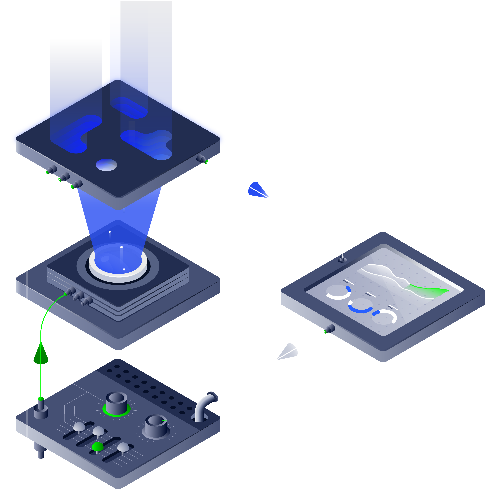
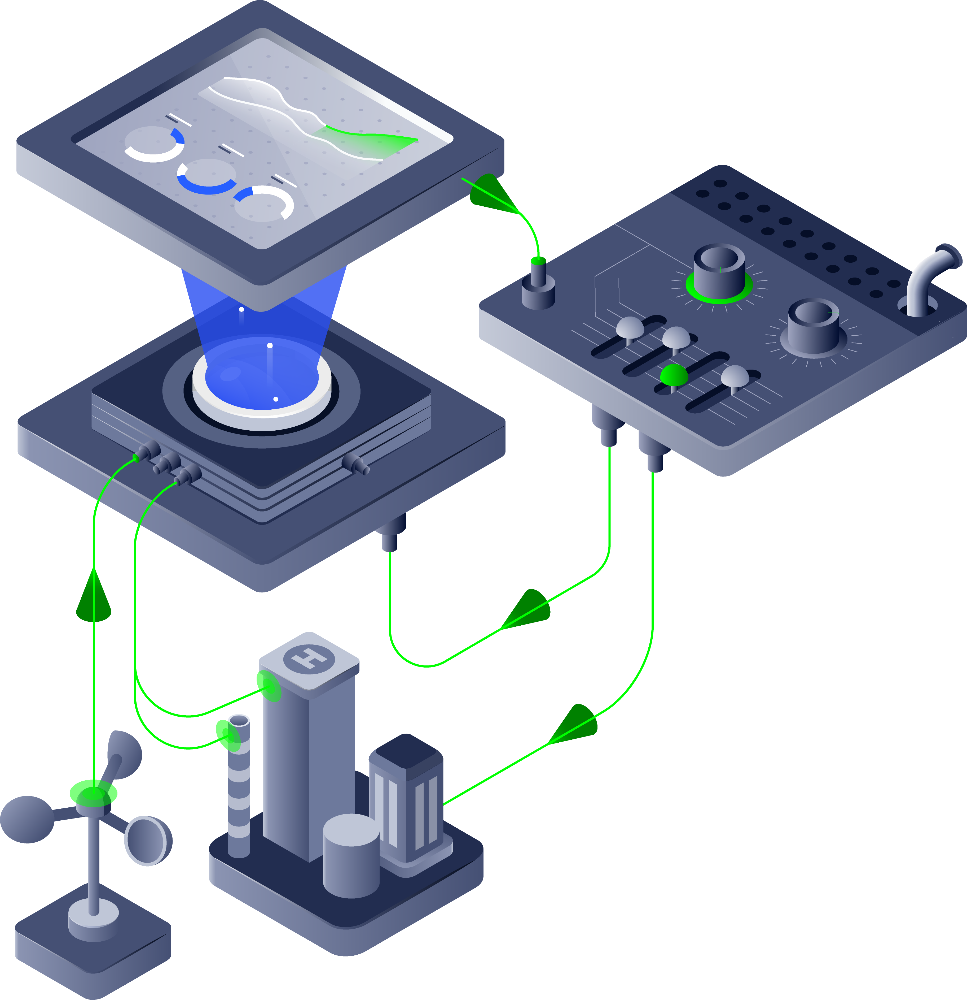
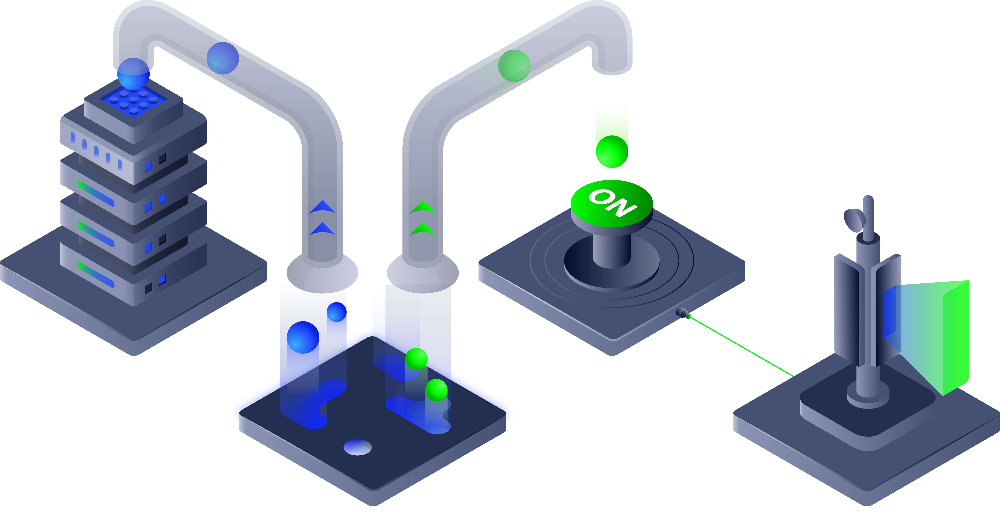

BSPump Documentation
====================

**bspump is at the heart of bitswan4stream and part of the bitswan4telco family.**

BSPump is an async-first stream processing framework for building data pipelines
and automations in Python and Jupyter notebooks. It provides a powerful, composable
architecture for ingesting, processing, and routing data at scale.

.. grid:: 2
    :gutter: 3

    .. grid-item-card:: Getting Started
        :link: getting-started/index
        :link-type: doc

        Install BSPump and build your first pipeline in minutes.

    .. grid-item-card:: Core Concepts
        :link: concepts/index
        :link-type: doc

        Understand pipelines, sources, processors, sinks, and connections.

    .. grid-item-card:: Patterns
        :link: patterns/index
        :link-type: doc

        Learn common patterns: webhook-to-kafka, kafka processing, scheduled tasks.

    .. grid-item-card:: Integrations
        :link: integrations/index
        :link-type: doc

        Connect to Kafka, HTTP, PostgreSQL, MongoDB, Elasticsearch, and more.

Key Features
------------

- **Async-First**: Built on asyncio for high-performance, non-blocking I/O
- **Jupyter Integration**: Develop and test pipelines interactively in notebooks
- **Composable Architecture**: Mix and match sources, processors, and sinks
- **Production Ready**: Battle-tested in telco and enterprise environments
- **Rich Integrations**: Kafka, HTTP webhooks, databases, message queues

Architecture
------------

BSPump pipelines consist of:

- **Sources**: Entry points for data (Kafka, HTTP webhooks, files, databases)
- **Processors**: Transform, filter, and enrich events
- **Sinks**: Output destinations (Kafka, databases, APIs, files)
- **Connections**: Shared, reusable connections to external systems

Quick Example
-------------

.. code-block:: python

    from bspump.jupyter import *
    import bspump.kafka

    @register_connection
    def connection(app):
        return bspump.kafka.KafkaConnection(app, "KafkaConnection")

    auto_pipeline(
        source=lambda app, pipeline: bspump.kafka.KafkaSource(
            app, pipeline, connection="KafkaConnection"
        ),
        sink=lambda app, pipeline: bspump.kafka.KafkaSink(
            app, pipeline, connection="KafkaConnection"
        ),
        name="ProcessingPipeline",
    )

    # Process events in notebook cells
    event = json.loads(event.decode("utf8"))
    event["processed"] = True
    event = json.dumps(event).encode()

.. toctree::
   :maxdepth: 2
   :caption: Contents
   :hidden:

   getting-started/index
   concepts/index
   patterns/index
   integrations/index
   jupyter/index
   configuration/index
   advanced/index
   api/index

Indices and tables
------------------

* :ref:`genindex`
* :ref:`modindex`
* :ref:`search`
